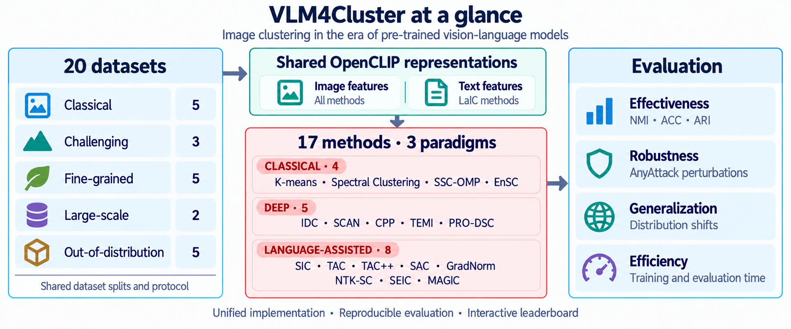

# VLM4Cluster

**A Unified Benchmark for Image Clustering in the Era of Pre-trained Vision-Language Models**

VLM4Cluster supports systematic and reproducible evaluation of classical, deep,
and language-assisted image clustering (LaIC) methods within a unified codebase.
Its core benchmark brings together **16 representative methods** and **20 datasets**,
with evaluation spanning **effectiveness, adversarial robustness, generalization
under distribution shifts, and time and memory efficiency**.

[Overview](#overview) |
[Methods](#supported-methods) |
[Datasets](#datasets) |
[Quick start](#quick-start) |
[Reproduction](docs/reproduction.md) |
[Leaderboard](https://vlm4cluster-leaderboard.yuanwei-hu.chatgpt.site) |
[Documentation](#documentation)

## Overview



Image clustering methods are often compared using results reported under different
dataset splits, backbone choices, image resolutions, and model-selection rules.
These differences can make it difficult to attribute improvements to the method
itself. Meanwhile, the strength of pre-trained vision-language models calls for
broader evaluation beyond traditional datasets and clustering accuracy alone.

VLM4Cluster addresses these challenges through:

- **Unified implementations and evaluation.** The core benchmark includes 4
  classical image clustering methods, 5 deep image clustering methods, and 7 LaIC
  methods. Shared data preparation, OpenCLIP model loading, configuration, and
  reporting support controlled comparisons. Method-specific adaptations and
  evaluation choices are documented explicitly.
- **Diverse datasets.** The benchmark covers 5 classical, 3 challenging, 5
  fine-grained, 2 large-scale, and 5 out-of-distribution (OOD) datasets.
- **Evaluation beyond effectiveness.** Alongside NMI, ACC, and ARI, the framework
  supports AnyAttack adversarial evaluation, ImageNet domain-shift evaluation,
  and time and memory measurements for ImageNet-1K experiments.
- **An interactive leaderboard.** Results are organized by dataset, method,
  metric, and vision-language model setting. Explore the
  [leaderboard](https://vlm4cluster-leaderboard.yuanwei-hu.chatgpt.site).
- **An extensible research codebase.** Dataset, feature extractor, and method
  registries support new components through the same experiment interface.

## Installation

Clone the repository and enter its root directory:

```bash
git clone https://github.com/hyw1008/VLM4Cluster.git
cd VLM4Cluster
```

Run commands from the repository root. The recommended setup uses conda and the
project's environment script; conda must already be installed. The script creates
the environment from `environment.yaml`, then installs the CUDA 12 FAISS wheel
separately with
`pip install faiss-gpu-cu12 --no-deps`. This avoids the conda FAISS/CUDA mismatch
described in the troubleshooting guide and prevents that install from upgrading
NumPy to 2.x.

```bash
bash setup_env.sh
conda activate vlm4cluster
```

The environment uses Python 3.12. The base configuration selects `cuda`; see
[troubleshooting](docs/troubleshooting.md) for FAISS/CUDA compatibility and
CPU-only installation instructions. On a CPU-only machine, also pass
`runtime.device=cpu` when running an experiment.

To update an existing environment:

```bash
bash setup_env.sh --update
```

## Quick start

List the registered components and inspect local dataset sizes:

```bash
python3 main.py list-datasets
python3 main.py dataset-stats --root data
python3 main.py list-extractors
python3 main.py list-methods
```

Use the existing base configuration and select a dataset and method through CLI
overrides. For example, validate the configuration and write an execution plan
for the CLIP-KMeans baseline on CIFAR-10:

```bash
python3 main.py run --config configs/experiments/base.toml --dry-run \
  dataset=cifar10 method=clip_kmeans
```

The dry run writes a plan without downloading datasets or model weights or
running clustering. Remove `--dry-run` to execute the experiment:

```bash
python3 main.py run --config configs/experiments/base.toml \
  dataset=cifar10 method=clip_kmeans
```

The full run prepares CIFAR-10, loads the selected OpenCLIP model, clusters the
evaluation-split image features, and reports NMI, ARI, and ACC. It requires the
runtime dependencies and access to any dataset or model files not already cached.

`dataset` is shorthand for `image_dataset.name`, and `method` is shorthand for
`method.name`. Method parameters can be set with either
`method.params.<parameter>=<value>` or `method.<parameter>=<value>`.
See [method hyperparameters](docs/method_hyperparameters.md) for defaults,
aliases, fixed hyperparameter profiles, and method-specific requirements.
The [reproduction guide](docs/reproduction.md) provides commands for every core
method, exact OpenCLIP checkpoint identifiers, external resource requirements,
and instructions for preserving results.

## Supported methods

The core benchmark covers the following 16 methods. Method names link
to their hyperparameters and implementation notes. The table also lists each
paper's publication venue and year, a paper link, and the CLI identifier used to
select the implementation.

| Paradigm | Method | Venue / Year | Paper / Reference | CLI identifier |
| --- | --- | --- | --- | --- |
| Classical image clustering | [K-means (CLIP-KMeans)](docs/method_hyperparameters.md#clip-kmeans) | - | [Reference](https://github.com/facebookresearch/faiss/wiki/Faiss-building-blocks:-clustering,-PCA,-quantization) | `clip_kmeans` |
| Classical image clustering | [Spectral Clustering (CLIP-SC)](docs/method_hyperparameters.md#clip-sc) | - | [Reference](https://scikit-learn.org/stable/modules/generated/sklearn.cluster.SpectralClustering.html) | `clip_sc` |
| Classical image clustering | [SSC-OMP](docs/method_hyperparameters.md#ssc-omp) | CVPR 2016 | [Paper](https://openaccess.thecvf.com/content_cvpr_2016/html/You_Scalable_Sparse_Subspace_CVPR_2016_paper.html) | `ssc_omp` |
| Classical image clustering | [EnSC](docs/method_hyperparameters.md#ensc) | CVPR 2016 | [Paper](https://openaccess.thecvf.com/content_cvpr_2016/html/You_Oracle_Based_Active_CVPR_2016_paper.html) | `ensc` |
| Deep image clustering | [IDC](docs/method_hyperparameters.md#idc) | NeurIPS 2024 | [Paper](https://proceedings.neurips.cc/paper_files/paper/2024/hash/4ac4365b98bc242acd5ab974a05c68a8-Abstract-Conference.html) | `idc` |
| Deep image clustering | [SCAN](docs/method_hyperparameters.md#scan) | ECCV 2020 | [Paper](https://www.ecva.net/papers/eccv_2020/papers_ECCV/html/1057_ECCV_2020_paper.php) | `scan` |
| Deep image clustering | [CPP](docs/method_hyperparameters.md#cpp) | ICLR 2024 | [Paper](https://proceedings.iclr.cc/paper_files/paper/2024/hash/697200c9d1710c2799720b660abd11bb-Abstract-Conference.html) | `cpp` |
| Deep image clustering | [TEMI](docs/method_hyperparameters.md#temi) | BMVC 2023 | [Paper](https://proceedings.bmvc2023.org/297/) | `temi` |
| Deep image clustering | [PRO-DSC](docs/method_hyperparameters.md#pro-dsc) | ICLR 2025 | [Paper](https://proceedings.iclr.cc/paper_files/paper/2025/hash/c20ac0df6c213db6d3a930fe9c7296c8-Abstract-Conference.html) | `pro_dsc` |
| Language-assisted image clustering | [SIC](docs/method_hyperparameters.md#sic) | AAAI 2023 | [Paper](https://ojs.aaai.org/index.php/AAAI/article/view/25841) | `sic` |
| Language-assisted image clustering | [TAC / TAC*](docs/method_hyperparameters.md#tac) | ICML 2024 | [Paper](https://proceedings.mlr.press/v235/li24aa.html) | `tac` |
| Language-assisted image clustering | [SAC](docs/method_hyperparameters.md#sac) | AAAI 2026 | [Paper](https://ojs.aaai.org/index.php/AAAI/article/view/40073) | `sac` |
| Language-assisted image clustering | [GradNorm](docs/method_hyperparameters.md#gradnorm) | ICCV 2025 | [Paper](https://openaccess.thecvf.com/content/ICCV2025/html/Peng_On_the_Provable_Importance_of_Gradients_for_Autonomous_Language-Assisted_Image_ICCV_2025_paper.html) | `gradnorm` |
| Language-assisted image clustering | [NTK-SC](docs/method_hyperparameters.md#ntk-sc) | ICLR 2026 | [Paper](https://arxiv.org/abs/2602.09586) | `ntk_sc` |
| Language-assisted image clustering | [SEIC](docs/method_hyperparameters.md#seic) | AAAI 2026 | [Paper](https://ojs.aaai.org/index.php/AAAI/article/view/39506) | `seic` |
| Language-assisted image clustering | [MAGIC](docs/method_hyperparameters.md#magic) | ICML 2026 | [Paper](https://openreview.net/forum?id=eyo7TITaF9) | `magic` |

For the general K-means and Spectral Clustering baselines, the reference links
document the computational backends used in this benchmark.

TAC and TAC* are two variants of one method, so the leaderboard can display 17
method/variant rows. In the leaderboard, TAC is the training-free variant
(`method.train_cluster_heads=false`), and TAC* trains cluster heads
(`method.train_cluster_heads=true`, the implementation default).

The [method source guide](docs/methods.md) records papers, official repository
links, checked upstream snapshots and licenses, and material benchmark
adaptations. Run `python3 main.py list-methods` to inspect the 16 registered
benchmark methods.

## Datasets

The 20 core datasets are organized into five groups:

| Group | Count | Datasets |
| --- | ---: | --- |
| Classical | 5 | CIFAR-10, CIFAR-20, STL-10, ImageNet-10, ImageNet-Dogs |
| Challenging | 3 | CIFAR-100, DTD, UCF101 |
| Fine-grained | 5 | Aircraft, Flowers, Food, Cars, Pets |
| Large-scale | 2 | Places365-Standard, ImageNet-1K |
| Out-of-distribution | 5 | ImageNet-A, ImageNet-C, ImageNet-R, ImageNet-V2, ImageNet-Sketch |

The OOD datasets are ImageNet variants used for target-side evaluation. The
ImageNet-C setting uses Gaussian noise at severity level 1, and ImageNet-V2 uses
`matched-frequency` by default. Available results vary by method and model setting;
benchmark coverage does not imply that every combination has a recorded result.

Dataset preparation:

- `cifar10`, `cifar20`, and `cifar100`: automatic downloads. `cifar20` uses the
  coarse labels of CIFAR-100.
- `stl10`, `dtd`, `places365_standard`, `aircraft`, `flowers`, `food`, and `pets`:
  automatic downloads through their dataset loaders.
- `imagenet`: manually prepared under `data/imagenet/...`.
- `imagenet10` and `imagenet_dogs`: subsets generated from a locally prepared
  ImageNet dataset using the class lists in `data/imagenet_subsets/`.
- `cars` and `ucf101`: manually prepared datasets; UCF101 uses extracted frames.
- `imagenet_a`, `imagenet_sketch`, `imagenet_r`, `imagenet_v2`, and `imagenet_c`:
  preparation requirements vary by dataset. ImageNet-R and ImageNet-V2 support
  optional automatic preparation.

Text resources:

- `class_names`: class names used directly as the text corpus.
- `wordnet`: the shared `WordNetNouns.csv` resource, included at
  `data/WordNetNouns.csv` as an unmodified copy from official TAC. Its
  [source manifest](data/WordNetNouns.source.json) records the exact upstream commit
  and checksum; see [text data](data/README.md#text-data) for provenance and license.

See [dataset sources and preparation notes](docs/datasets.md) and the
[data layout guide](data/README.md) for details.

## Shared vision-language models

`openclip_pretraining` and `openclip_backbone` jointly select the model:

- `LAION400M` and `LAION2B`: `ViT-B/32`, `ViT-B/16`, and `ViT-L/14`.
- `SigLIP`: `ViT-B/16` (SigLIP v1 B/16-224, pretrained on WebLI).

To select SigLIP B/16 in a method configuration:

```toml
[method.params]
openclip_pretraining = "SigLIP"
openclip_backbone = "ViT-B/16"
```

The same settings can be passed through the CLI:

```bash
python3 main.py run --config configs/experiments/base.toml \
  dataset=cifar10 method=clip_kmeans \
  method.openclip_pretraining=SigLIP \
  method.openclip_backbone=ViT-B/16
```

OpenCLIP loads the complete `ViT-B-16-SigLIP` / `webli` checkpoint. Image and text
features come from the visual and text towers of that same SigLIP model; a timm
image-only checkpoint is not used. Methods without a SigLIP-specific fixed
hyperparameter profile retain their existing fallback settings and do not inherit
the tuned `LAION400M + ViT-B/16` profile.

The available LAION and SigLIP checkpoints also differ in pretraining data and
training recipe. Comparisons therefore evaluate different pretrained checkpoints
and model families, rather than a controlled causal ablation of the loss alone.

## Evaluation and output artifacts

By default, evaluation reports `NMI/ARI/ACC`.

<details>
<summary>Internal metrics without ground-truth labels</summary>

To report only internal metrics that
do not require ground-truth (GT) labels, use the shared evaluation switch:

```toml
[evaluation]
metrics = ["nmi", "ari", "acc"]
internal_metrics_only = true
silhouette_metric = "cosine"
silhouette_sample_size = 5000
```

Or enable it for a single run:

```bash
python3 main.py run --config configs/experiments/base.toml \
  dataset=cifar10 method=clip_kmeans internal_metrics_only=true
```

When enabled, the top-level `metrics` field contains only `sil`, `dbi`, and `chi`.
When disabled, evaluation follows the existing external-metric path. All internal
metrics use shared OpenCLIP evaluation image features with per-sample L2
normalization. SIL uses the configured distance (cosine by default); DBI and CHI
use the scikit-learn definitions.

`internal_metrics_only` changes only the final evaluator. It does not change a
method's training, epoch selection, or fixed number of clusters (`K`). It therefore
provides final metrics without GT labels. If a method uses GT labels to select a
checkpoint or hyperparameters, that selection logic must also be disabled before
the entire model-selection procedure can be described as label-free.

</details>

<details>
<summary>Output files and directory layout</summary>

Each configuration that affects predictions is recorded in a separate trial:

```text
outputs/<method>/<dataset>/<openclip>/seed_<seed>/
└── trials/trial_<fingerprint>/
    ├── trial.json
    ├── external/
    │   ├── plan.json
    │   ├── predictions.npz
    │   └── report.json
    └── internal/
        ├── plan.json
        ├── predictions.npz
        └── report.json
```

Each run writes to the directory for its selected evaluation mode; both modes are
shown above. `predictions.npz` stores the main predictions, extra predictions, and
sample indices. The `artifacts` field in `report.json` records both the prediction
file and the corresponding shared OpenCLIP cache for later offline metric
recomputation.

</details>

## AnyAttack robustness evaluation

Prepare the method's required resources, including the bundled vocabulary for TAC,
and the AnyAttack-Cos decoder checkpoint before running:

```bash
python3 main.py run --config configs/experiments/base.toml \
  method=tac dataset=cifar10 attack=anyattack \
  attack.decoder_path=data/anyattack/checkpoints/coco_cos.pt \
  attack.eps=0.03137254901960784
```

`attack=anyattack` enables an adversarial image variant under
`image_dataset.attack`. By default, it uses the AnyAttack-Cos `coco_cos.pt`
checkpoint and attacks only the `test`/`val` splits. Methods can therefore train
on the clean training split and evaluate on the adversarial evaluation split.
The default perturbation budget is `epsilon=8/255`, matching the recorded
leaderboard setting. The command above states this budget explicitly as a
decimal value; other budgets can be selected with `attack.eps=<float>`.

Adversarial images are materialized under `data/adversarial/anyattack/...`.
The OpenCLIP feature cache and method-specific derived caches include an attack
token to prevent reuse of clean-image caches.

## Efficiency measurements

Only ImageNet-1K experiments record efficiency data in the `efficiency` field of
the completed `report.json`; this field is `null` for other datasets.
`train_eval_time_seconds` measures the combined time for method training and
final evaluation inference. `peak_cpu_memory_mb` measures process-tree RSS, and
`peak_gpu_memory_mb` measures peak CUDA allocated memory. Both memory values are
reported in MiB.

The memory measurement window covers dataset preparation, model loading, shared
OpenCLIP feature encoding, method training, final inference, and metric
calculation. Measurement pauses only while AnyAttack adversarial images are
actually being generated. When a training-based method reuses a checkpoint,
inference-only time is not reported as full training-and-evaluation efficiency.

## Leaderboard

The interactive leaderboard is maintained separately from this experiment
codebase and is available as a public website.

**[Open the VLM4Cluster leaderboard](https://vlm4cluster-leaderboard.yuanwei-hu.chatgpt.site)**

The leaderboard covers five vision-language model settings and includes
AnyAttack-Cos evaluation at $\epsilon=8/255$ on LAION-400M ViT-B/32. See the
[results guide](docs/results.md) for coverage, metric display, TAC variants,
and efficiency measurement notes. Supported experiments without a recorded
result remain unreported.

## Documentation

| Guide | Contents |
| --- | --- |
| [Dataset notes](docs/datasets.md) | Dataset groups, sources, and acquisition requirements |
| [Data layout](data/README.md) | Directory structure and manually prepared resources |
| [Methods and sources](docs/methods.md) | The 16 benchmark methods, papers, upstream versions/licenses, and adaptations |
| [Reproduction guide](docs/reproduction.md) | Per-method commands, resources, model identifiers, evaluation choices, and result records |
| [Method hyperparameters](docs/method_hyperparameters.md) | Defaults, fixed profiles, aliases, and adaptations to the benchmark protocol |
| [Troubleshooting](docs/troubleshooting.md) | FAISS/CUDA compatibility and CPU-only setup |
| [Results guide](docs/results.md) | Leaderboard availability, recorded result coverage, and metric interpretation |

## Repository structure

```text
.
├── configs/
│   └── experiments/
├── data/
├── docs/
├── main.py
├── pyproject.toml
└── vlm4cluster/
    ├── cli.py
    ├── config.py
    ├── runner.py
    ├── datasets/
    ├── evaluation/
    ├── features/
    ├── methods/
    └── utils/
```

## Framework conventions

<details>
<summary>Method modules, feature inputs, and entry point</summary>

1. Each method has its own module under `vlm4cluster/methods/`.
2. Methods that depend on raw image augmentation declare `requires_raw_images = true`.
3. Methods that require runner-provided image features configure `image_features`.
4. Methods that require runner-provided text features configure both `text_dataset`
   and `text_features`. Methods that load their text resources internally document
   those requirements in their method descriptions.
5. All experiments use the shared `main.py` entry point.

</details>

## Extending the benchmark

- **Image datasets:** register a spec in `vlm4cluster/datasets/image_datasets.py`.
- **Text datasets:** register a spec in `vlm4cluster/datasets/text_datasets.py`.
- **Image feature extractors:** register an extractor in `vlm4cluster/features/image.py`.
- **Text feature extractors:** register an extractor in `vlm4cluster/features/text.py`.
- **Clustering methods:** add a module under `vlm4cluster/methods/`, register the
  method, and import it in `vlm4cluster/methods/__init__.py`.

Document each method's parameters and any adaptations to the shared benchmark
protocol in [method hyperparameters](docs/method_hyperparameters.md).
